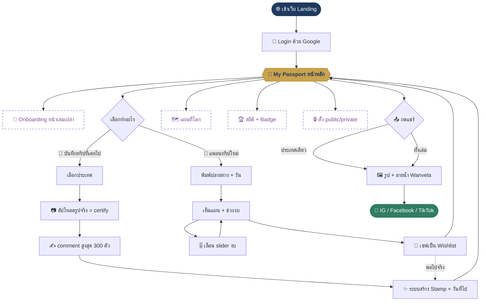

# Wanderpass — PRD (v1.1)

> **Tech stack (ล็อก — ห้ามเปลี่ยน):** Next.js (App Router) + TypeScript + Tailwind CSS + shadcn/ui + Supabase (DB & Auth) + Resend (email) + Vercel
> **ดีไซน์:** mobile-first · โทน navy / gold / cream
> **ลิงก์ mockup + workflow (live):** https://wanderpass-mockup-1780119775-97zynaw2h-tossapats-projects.vercel.app
> **สถานะ:** อนุมัติแล้ว — กำลัง build บน `wanderpass-starter`

🆕 = ฟังก์ชันที่เพิ่มเข้ามาในรอบรีวิว (รวม 6 ข้อ)

---

## 1. Business context
Wanderpass คือเว็บแอปสมุด **Passport ท่องเที่ยวดิจิทัล** ที่ให้คนเอา **รูปจริง** ของทริปที่เคยไปมาลง แล้วระบบแปลงเป็น **Stamp การ์ตูนน่ารัก** รายประเทศ พร้อมเขียน comment เก็บเป็นความทรงจำ ผู้ใช้คือนักท่องเที่ยวไทยทุกวัย (15–60) ที่อยากเก็บ Journey สวยๆ และอวดเพื่อนได้ ทุกภาพที่แชร์ออกไปติด **ลายน้ำ Wanvela** จึงกลายเป็น free marketing tool ในตัว และมีพาร์ท **แพลนทริปใหม่** ที่เลื่อนงบประมาณดูได้เพื่อจุดประกายทริปถัดไป

## 2. Customer journey
1. เข้าเว็บ Landing
2. Login ด้วย Google
3. 🆕 ถ้าเล่มเปล่า → เจอหน้า **Onboarding** ชวนเพิ่มทริปแรก
4. เข้า **My Passport** (เห็น 🆕 แผนที่โลก + 🆕 สถิติ/Badge)
5. เลือก **"บันทึกทริปที่เคยไป"** หรือ **"แพลนทริปใหม่"**
6. *(เคยไป)* เลือกประเทศ → อัปโหลดรูปจริง → เขียน comment → ระบบสร้าง Stamp 🆕 พร้อมบันทึกวันที่ไป
7. *(แพลนใหม่)* พิมพ์ปลายทาง + จำนวนวัน → เลื่อน slider งบ → เซฟเป็น Wishlist
8. 🆕 พอไปจริง กดเปลี่ยน Wishlist เป็น Stamp
9. กดแชร์ (ประเทศเดียว / ทั้งเล่ม) ติดลายน้ำ → ลง IG / Facebook / TikTok

## 3. Screens (หน้าที่ลูกค้าเห็น)
- **A. Landing + Login** — บอกว่าแอปทำอะไร · ปุ่มเดียว: เข้าสู่ระบบด้วย Google
- **B. My Passport (หน้าหลัก)** — 🆕 แถบแผนที่โลก, 🆕 สถิติ (กี่ประเทศ / ทวีป / แสตมป์), grid Stamp, bottom nav · ปุ่ม: + บันทึกทริป / แพลนทริป / แชร์ทั้งเล่ม
- **C. Add Country (สร้าง Stamp)** — เลือกประเทศ, อัปโหลดรูปจริง, comment, พรีวิว Stamp · ปุ่ม: บันทึก / ยกเลิก
- **D. Trip Planner** — พิมพ์ปลายทาง+วัน, slider งบ (เลื่อนละเอียด), แผนรายวันย่อ · ปุ่ม: เซฟ Wishlist / ปรึกษาทีมจัดทริป
- **E. Country Detail** — 🆕 วันที่ไป, แกลเลอรีรูปจริง, comment, 🆕 ปุ่ม public/private · ปุ่ม: แก้ไข / ลบ / แชร์ประเทศนี้
- **F. Share** — พรีวิวรูป + ลายน้ำ Wanvela · ปุ่ม: IG / Facebook / TikTok / ดาวน์โหลด / คัดลอกลิงก์
- 🆕 ทุกหน้ามีปุ่ม **ออกจากระบบ / จัดการบัญชี** ในเมนูตั้งค่า

## 4. Admin screens (เจ้าของเห็น)
- รายชื่อผู้ใช้ + จำนวนทริปที่บันทึก
- ประเทศยอดฮิต + ยอดแชร์ (วัดผล marketing)
- จัดการคลังดีไซน์ **Stamp** (เพิ่ม/เปลี่ยนรูปการ์ตูนรายประเทศ)
- ตั้งค่า **ลายน้ำ** (โลโก้/ตำแหน่ง/ความเข้ม)
- 🆕 คิวรูปที่ถูกรายงาน เพื่อกดซ่อน

## 5. Data we need to store
- **ผู้ใช้:** ชื่อ, อีเมล (จาก Google)
- **แต่ละประเทศ:** ประเทศที่เลือก, รูปจริงที่อัปโหลด, comment, Stamp, 🆕 วันที่เดินทาง, 🆕 สถานะ public/private
- **Wishlist:** ปลายทาง, จำนวนวัน, งบที่เลื่อนไว้, แผนรายวันย่อ
- **คลัง Stamp:** รูปการ์ตูนของแต่ละประเทศ
- **สถิติการแชร์:** ใครแชร์อะไร ลงที่ไหน เมื่อไหร่
- 🆕 รายการรูปที่ถูกรายงาน

## 6. Business rules
- 1 ประเทศ = 1 Stamp (เพิ่มรูป/comment ในประเทศเดิมได้)
- ต้องมีรูปจริง ≥ 1 รูป ถึงจะออก Stamp ได้ (ใช้ certify ว่าไปจริง)
- 🆕 **ไฟล์รูปที่รับ:** JPG / JPEG · PNG · HEIC/HEIF (ค่าเริ่มต้น iPhone) · WebP — ระบบแปลง HEIC → JPEG อัตโนมัติให้เปิดได้ทุกเครื่อง
- 🆕 **ขนาดสูงสุด 10 MB / รูป · สูงสุด 10 รูป / ประเทศ** (ระบบย่อรูปอัตโนมัติให้โหลดไว)
- 🆕 **comment สูงสุด 300 ตัวอักษร**
- ทุกภาพที่แชร์ติดลายน้ำ Wanvela เสมอ
- งบในแพลน = ช่วงประมาณการ (ไม่ใช่ราคาขายจริง)
- 🆕 ค่าเริ่มต้นของ Passport เป็น **private** — ผู้ใช้เลือกเปิด public เองรายประเทศ

## 7. Edge cases
- เลือกประเทศซ้ำ → ไปหน้าประเทศเดิม ให้เพิ่มรูป/comment แทนการสร้างใหม่
- ไฟล์ผิด / ใหญ่เกิน / นามสกุลไม่รองรับ → แจ้งเตือนสุภาพ + บอกที่รับได้
- กดแชร์ตอนเล่มว่าง → ปิดปุ่ม + ข้อความ "เพิ่มทริปแรกก่อนนะ"
- เน็ตหลุดตอนบันทึก → เก็บ draft ไม่ให้รูป/comment หาย
- slider งบสุดขอบ → ล็อก + ย้ำว่าเป็นประมาณการ
- 🆕 รูปไม่เหมาะสม → ผู้ใช้/ระบบรายงาน → admin ซ่อนได้
- ⚠ **Assumption — confirm:** ราคาในแพลนใช้ **mock data** ก่อน (ยังไม่ต่อ trip.com / Agoda ใน v1)

## 8. Notifications (Resend)
- อีเมลต้อนรับหลังสมัครครั้งแรก: ชวนบันทึกทริปแรก
- 🆕 อีเมลเตือนเบาๆ เมื่อมี Wishlist ค้างไว้นาน ("พร้อมออกเดินทางหรือยัง?")
- v1 ไม่มี SMS (จะมาพร้อมระบบ OTP เบอร์โทรในเวอร์ชันใช้จริง)

## 9. Out of scope (v1 ยังไม่ทำ)
- เชื่อมราคาจริง trip.com / Agoda (ใช้ mock ก่อน)
- ระบบจอง / ชำระเงินในแอป
- OTP เบอร์โทร (ใช้ Google ก่อน)
- ไลก์ / คอมเมนต์ระหว่างผู้ใช้
- 📖 ดาวน์โหลด / สั่งพิมพ์ Travel Book เป็น PDF *(ดันไป v2)*
- ระดับเมือง / จังหวัด (ไม่ใช่แค่ประเทศ)
- แท็กเพื่อนร่วมทริป
- แอปมือถือ native
- หลายภาษา (ไทยก่อน)

---

## 🗺️ Workflow Diagram
> เส้นประม่วง = 6 ฟังก์ชันใหม่ใน v1 · แก้ทีละ node ได้

---

## 🎨 Brand tokens
| | |
|---|---|
| Navy (primary) | `#1f3a5f` |
| Gold (accent) | `#c9a24b` |
| Cream (background) | `#f7f3ea` |
| Ink (text) | `#23303f` |
| Green (share) | `#2f7d62` |
| ฟอนต์ | Noto Sans Thai |

---

## 📋 Build checklist (สถานะการสร้าง)
- [x] PRD + Workflow + Mobile mockup (อนุมัติแล้ว)
- [ ] รีแบรนด์เป็น navy/gold/cream + ภาษาไทย
- [ ] หน้า A — Landing + Login (Google)
- [ ] หน้า B — My Passport (map band + สถิติ + grid)
- [ ] หน้า C — Add Country (อัปโหลดรูป + comment 300 ตัว + Stamp)
- [ ] หน้า D — Trip Planner (slider งบ)
- [ ] หน้า E — Country Detail (วันที่ไป + public/private)
- [ ] หน้า F — Share (ลายน้ำ + IG/FB/TikTok)
- [ ] Supabase schema: trips, trip_photos, wishlist, reports
- [ ] Admin: ผู้ใช้ + ประเทศฮิต + คิวรายงาน
